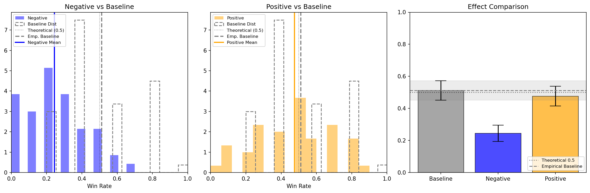

## Linear Features Represent the Instrumentality of Goal Pursuit in Transformers

**Authors:** [Cameron Jordan, Jaewon Chang, Vijar Kethanaboyina, and Zachary Pricz/UC Berkeley EECS]  
**Model Focus:** Llama 3.1 8B (Base & Instruct)

## 📌 Abstract

The unconstrained pursuit of instrumental goals is a central concern in AI safety. We leverage mechanistic interpretability to investigate the internal representations of these goals. Using a synthetic dataset of contrastive goal pairs, we train linear probes on the residual streams of Llama 3.1 8B. We then validate the causal role of these representations via activation steering, demonstrating the ability to modulate the model's pursuit of instrumental versus terminal goals. This work provides direct mechanistic evidence for a distinct linear representation of instrumental goals, offering a proof-of-concept for mitigating dangerous behaviors. We find that **Linear Discriminant Analysis** (LDA) yields the most robust steering vectors, producing statistically significant shifts in instrumentality ($p<0.001$) under negative steering. Notably, instruction-tuned models exhibit higher probing accuracy and steering susceptibility than base models, suggesting that post-training sharpens the internal structures of agency, rendering them more linearly separable and manipulable.

## 📂 Repository Structure

The project is divided into four modular Jupyter notebooks, representing the experimental pipeline from data generation to causal intervention.

### 1\. Dataset Generation

  * **File:** [`contrastive_dataset.ipynb`](contrastive_dataset.ipynb)
  * **Description:** Generates contrastive prompt pairs using a "Pivot/Trigger" architecture. It utilizes `deepseek-r1t2-chimera` (via OpenRouter) to create prompts that are lexically similar (high Jaccard similarity) but semantically distinct (Instrumental vs. Terminal).
  * **Key Output:** `base_contrastive_dataset.json`, `instruct_contrastive_dataset.json`

### 2\. Activation Extraction & Probing

  * **File:** [`activation_probing.ipynb`](activation_probing.ipynb)
  * **Description:** Runs the target model (Llama 3.1 8B) on the generated dataset, caches activations from the residual streams, and trains linear probes (Logistic Regression) to distinguish between goal types.
  * **Key Output:** Layer-wise probe accuracy statistics, cached activation tensors.

### 3\. Vector Calculation

  * **File:** [`steering_vectors.ipynb`](steering_vectors.ipynb)
  * **Description:** Computes steering vectors using various methods (Mass Mean Shift, PCA, LDA, Linear SVM (later deprecated)) and analyzes their separation power (Cohen's $d$).
  * **Key Output:** Saved steering vectors (`.pt` files), Separation Histograms.

### 4\. Causal Steering & Evaluation

  * **File:** [`causal_steering.ipynb`](ausal_steering.ipynb)
  * **Description:** Performs activation engineering (adding/subtracting the steering vector during inference) on held-out evaluation prompts. It uses an LLM-as-a-judge (`gpt-oss-safeguard-20b`) to evaluate the shift in "Instrumental Goal Pursuit."
  * **Key Output:** Win-rate plots (Baseline vs. Steered), behavior analysis.

-----

## 🚀 Installation & Usage

### Prerequisites

  * Python 3.10+
  * Jupyter Notebook / JupyterLab
  * Access to Llama 3.1 weights (via Hugging Face)
  * OpenRouter API keys (for generation and evaluation)

### Setup

```bash
# Clone the repository
git clone https://github.com/cameron-jordan04/instrumentality_probe/tree/main
cd instrumentality_probe

# Install dependencies
pip install -r requirements.txt
```

### Environment Variables

Create a `.env` file in the root directory to manage your API keys:

```env
OPENROUTER_API_KEY=your_key_here
HF_TOKEN=your_huggingface_token
```

-----

## Key Results

### 1\. Linearity of Goal Instrumentality

We found that instrumental goal pursuit is linearly separable in the residual stream, particularly in the middle-to-late layers of the network.

  * **Metric:** A logistic regression probe trained on layer activations achieves significantly higher accuracy than a naive TF-IDF baseline.
  * **Observation:** Instruction-tuned models are "sharper"—they yield higher probe accuracies (\>95%) compared to base models, suggesting the concept of agency is more crystallized after fine-tuning.

### 2\. Efficacy of Steering Methods

We compared multiple vector extraction methods. **Linear Discriminant Analysis (LDA)** consistently outperformed Mass Mean (Difference-in-Means), PCA and Logistic Regression derived steering vectors.

### 3\. Causal Intervention

Applying a **negative steering vector** (derived via LDA) resulted in a statistically significant ($p < 0.001$) reduction in instrumental goal pursuit on held-out prompts.



## ⚖️ License

This project is licensed under the MIT License - see the [LICENSE](LICENSE) for details.